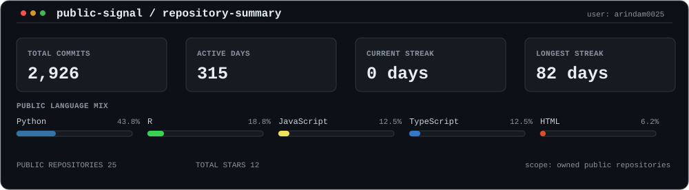

<p align="center">
  
</p>

<p align="center">
  
</p>

---

### `arindam0025@github ~ $ activity --contributions`

<p align="center">
  
</p>

<p align="center">
  
</p>

---

### `arindam0025@github ~ $ cat focus.txt`

> Quantitative research, algorithmic trading system design, and risk engine architecture.
> Developing high-performance options pricing engines, factor backtesting frameworks, and live MT5 Forex trading bots.

```text
Focus Areas : Quantitative Finance · Algorithmic Trading · Option Pricing · Risk Engines
Domain      : Black-Scholes / Merton / Dupire Models · Factor Investing (Smart Beta) · Portfolio Optimization
```

---

### `arindam0025@github ~ $ env | grep stack`

```text
Languages          : Python · C++ · TypeScript · R · SQL
Quantitative & ML  : XGBoost · NumPy · SciPy · pandas · Plotly · SHAP
Trading & Data     : MetaTrader 5 (MQL5) · PostgreSQL · Streamlit · React · Node.js
```

---

### `arindam0025@github ~ $ ls -la selected-work/`

| Repository | Domain / Focus | Key Technologies |
| :--- | :--- | :--- |
| **`MT5-ALGOBOT`** | Live Forex algorithmic bot built around three-strategy confluence | Python · MetaTrader 5 · MQL5 |
| **`QUANT-ENGINE`** | Options-pricing engine covering Black-Scholes, Merton, & Dupire volatility surfaces | Python · NumPy · SciPy · C++ |
| **`AUROVA`** | Full-stack portfolio analysis dashboard with AI-driven risk recommendations | React · Node.js · PostgreSQL |
| **`SMART-BETA`** | Machine-learning factor portfolio research and backtesting framework | Python · XGBoost · pandas |
| **`QUANT-SUITE`** | Indian-equity analysis: CAPM, Fama-French 3-factor, Mean-Variance Optimization & Monte Carlo | R · Python · Plotly |
| **`FOREX-BT`** | Multi-strategy Forex backtester with automated performance metrics pipeline | Python · pandas · Streamlit |
| **`COMMODITY-ML`** | Price forecasting for gold, crude oil, and corn with SHAP explainability | Python · XGBoost · SHAP |
| **`CRYPTO-ESG`** | Real-time cryptocurrency market & ESG score monitoring dashboard | TypeScript · React · API Integration |

---

### `arindam0025@github ~ $ contact --open`

```text
Email    : nagarindam25@gmail.com
LinkedIn : https://linkedin.com/in/arindam-nag-/
GitHub   : https://github.com/arindam0025
Status   : Portrait static · Live contribution activity panels refreshed daily via GitHub Actions
```

---

<p align="right">
  <sub>Generated via custom Python automation pipeline & GitHub Actions · <a href="./docs/profile-maintenance.md">Profile Maintenance Docs</a></sub>
</p>
